# CargoTrack

Plataforma de rastreamento logístico e telemetria de frotas em tempo real, projetada para simular e processar grandes volumes de dados provenientes de veículos conectados.

A solução demonstra arquitetura distribuída orientada a eventos (**CQRS leve + Kafka**), ingestão massiva de dados IoT, monitoramento de frotas e análise operacional.

---

## Fluxo da solução

<p align="left">
  
</p>

```
Simulador (Node) → Ingestion → telemetry-events → Fleet (write)
  → PostgreSQL + Redis + TimescaleDB + domain-events → Alert → Query API (read)
```

---

## Principais funcionalidades

- Simulação de **1.000+** veículos com telemetria contínua (GPS, sensores, eventos operacionais)
- Processamento de eventos em alta escala via **Apache Kafka**
- Estado atual da frota em **Redis** e histórico em **TimescaleDB**
- Alertas em tempo real (velocidade, temperatura, desvio, offline)
- Dashboard operacional com **WebSocket**

---

## Stack (resumo)

| Camada | Tecnologia |
|--------|------------|
| Backend | Java 21 · Spring Boot 3 |
| Simulador | Node.js |
| Mensageria | Kafka (`telemetry-events` + `domain-events`) |
| Dados | PostgreSQL · Redis · TimescaleDB |
| Infra (MVP) | Docker Compose |

Detalhes: [docs/architecture/stack.md](docs/architecture/stack.md)

---

## Documentação

| Seção | Link |
|-------|------|
| Índice completo | [docs/README.md](docs/README.md) |
| Visão de produto | [docs/product/overview.md](docs/product/overview.md) |
| System Design | [docs/architecture/system-design.md](docs/architecture/system-design.md) |
| Roadmap | [docs/product/roadmap.md](docs/product/roadmap.md) |
| Getting Started | [docs/development/getting-started.md](docs/development/getting-started.md) |

---

## Contribuir

Veja [CONTRIBUTING.md](CONTRIBUTING.md).

---

## Licença

Este projeto é disponibilizado sob a licença MIT para fins educacionais e de demonstração de arquitetura. Veja [LICENSE](LICENSE).
