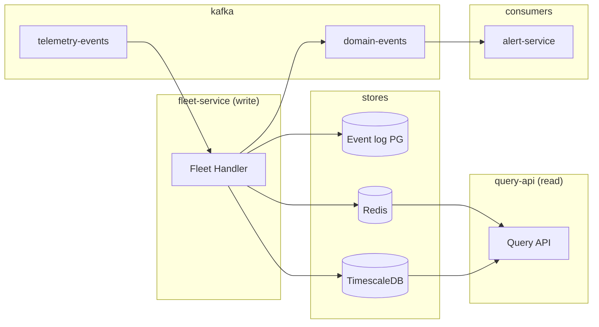
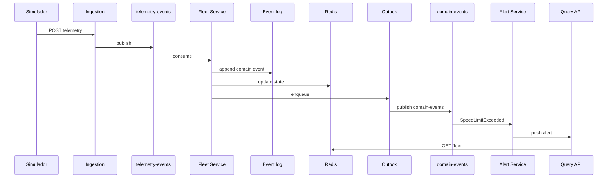

# System Design — CargoTrack

> Plataforma de rastreamento logístico e telemetria de frotas em tempo real.

**Stack adotada:** Java/Spring Boot (backend) · Node.js (simulador) · Kafka · PostgreSQL · Redis · TimescaleDB

**Padrão de dados:** **CQRS leve + `domain-events`** — detalhes em [stack.md](./stack.md)

---

## 1. Contexto e Objetivo

### Problema

Uma transportadora precisa monitorar **1.000+ caminhões** em tempo real. Cada veículo transmite, a cada poucos segundos, GPS, velocidade, combustível, temperatura e eventos operacionais — gerando **milhões de eventos por dia**.

### Objetivo

Demonstrar arquitetura orientada a eventos com **CQRS leve**, Kafka em dois tópicos (`telemetry-events` + `domain-events`), e observabilidade — usando **Java** no backend e **Node.js** no simulador de carga.

### Referências

- [README](../README.md) — visão de produto
- [stack.md](./stack.md) — decisão tecnológica adotada

---

## 2. Requisitos

### Funcionais

| ID | Requisito |
|----|-----------|
| RF-01 | Receber telemetria de milhares de veículos simultaneamente |
| RF-02 | Manter estado atual de cada veículo |
| RF-03 | Detectar e emitir alertas (velocidade, temperatura, desvio, offline) |
| RF-04 | Persistir event log append-only (auditoria) |
| RF-05 | Consultas rápidas de frota |
| RF-06 | Histórico de rotas |
| RF-07 | Dashboard com atualizações em tempo real (WebSocket) |
| RF-08 | Simulador de frota (Node.js) |

### Não-funcionais

| ID | Requisito | Meta |
|----|-----------|------|
| RNF-01 | Latência ingestão → Kafka (P99) | < 100 ms (local) |
| RNF-02 | Throughput | ≥ 1.000 eventos/s (MVP) |
| RNF-03 | Disponibilidade | 99,9% (produção) |
| RNF-04 | Isolamento de falha | Erro em um veículo não derruba o consumer |
| RNF-05 | Observabilidade | Métricas, logs, traces |

---

## 3. Arquitetura de Alto Nível

### Princípios

1. **Event-Driven Architecture (EDA)** — Kafka como barramento; dois tópicos com papéis distintos
2. **CQRS leve** — write side (`fleet-service`) grava event log + read models; read side (`query-api`) consulta só Redis e TimescaleDB
3. **`domain-events`** — bus de fatos de negócio para consumidores desacoplados (alertas, analytics); **não** substitui projeções síncronas no MVP
4. **Partition key = `vehicleId`** — ordenação por veículo em ambos os tópicos
5. **REST no MVP** — gRPC como evolução futura — simulador Node suporta ambos protocolos

### CQRS leve vs Event Sourcing completo

| Aspecto | CargoTrack (adotado) | Event Sourcing completo (pós-MVP) |
|---------|----------------------|-----------------------------------|
| Fonte do estado atual | Redis (atualizado pelo fleet) | Replay de eventos |
| Event log (PostgreSQL) | Auditoria | Única fonte de verdade |
| Read models | Projeção **síncrona** no fleet | Projeção **assíncrona** via consumer |
| `domain-events` | Notifica outros serviços | Obrigatório para materializar read models |

### Diagrama de contexto

```
┌───────────────────────────────────────────────────────────────────────────────┐
│                         CargoTrack Platform                                   │
│                                                                               │
│  ┌──────────────┐   POST JSON / gRPC ┌─────────────────────────────┐          │
│  │  Simulador   │ ──────────────────►│  Ingestion Service (Java)   │          │
│  │  (Node.js)   │                    └──────────────┬──────────────┘          │
│  └──────────────┘                                   │                         │
│                                                     ▼                         │
│                                          telemetry-events                     │
│                                                     │                         │
│                                                     ▼                         │
│                                          ┌─────────────────┐                  │
│                                          │  Fleet Service  │                  │
│                                          │  (write side)   │                  │
│                                          └────────┬────────┘                  │
│                                                   ▼                           │
│              ┌──────────────────┬────────────┬─────────────────┐              │
│              ▼                  ▼            ▼                 ▼              │
│  ┌────────────────────────┐┌─────────┐┌─────────────┐  ┌───────────────┐      │
│  │ Event log (PostgreSQL) ││ Redis   ││ TimescaleDB │  │ domain-events │      │
│  └───────────┬────────────┘└────┬────┘└─────┬───────┘  └───────┬───────┘      │
│              │                  │           │           ┌──────┴────┐         │
│              │                  │           │           ▼           ▼         │
│              │                  │           │    ┌─────────────┐┌───────────┐ │
│              │                  │           │    │Alert Service││ Analytics │ │
│              │                  │           │    │  (Java)     ││ (opcional)│ │
│              │                  │           │    └────┬────────┘└─────┬─────┘ │
│              └──────────────────┴───────────┴─────────┼───────────────┘       │
│                                                       ▼                       │
│           ┌─────────────────────────────────────────────────────────────┐     │
│           │        Query API (Read Side) — REST + WebSocket             │     │
│           └───────────────────────────────────────────┬─────────────────┘     │
└───────────────────────────────────────────────────────┼───────────────────────┘
                                                        ▼
                                        Operadores / Dashboard (WebSocket)
```

### Fluxo principal

```
Simulador (Node)
      │  POST /api/v1/telemetry  (JSON)
      ▼
Ingestion Service
      ▼
Kafka: telemetry-events  (key: vehicleId)
      ▼
Fleet Service (write side)
      │  regras de negócio
      ├──► event log — INSERT domain_events (PostgreSQL)
      ├──► projeção síncrona — UPDATE Redis
      ├──► projeção síncrona — INSERT vehicle_locations (TimescaleDB)
      └──► outbox → publish domain-events (Kafka)
                │
                ├──► alert-service (alertas, push WebSocket)
                └──► analytics (opcional, pós-MVP)
      │
Query API (read side)
      ├── GET ← Redis + TimescaleDB
      └── WebSocket ← alert-service ou consumer de domain-events
```

---

## 4. Componentes

### 4.1 Simulador de Frota (`simulator/`) — Node.js

| Aspecto | Detalhe |
|---------|---------|
| Linguagem | **Node.js** 20+ |
| Transporte | **REST** (POST JSON) — MVP |
| Config | `VEHICLE_COUNT`, `INTERVAL_MS`, `INGESTION_URL` |

```http
POST /api/v1/telemetry HTTP/1.1
Content-Type: application/json

{
  "eventId": "uuid",
  "vehicleId": "TRK-001",
  "timestampMs": 1717080123123,
  "payload": {
    "type": "location",
    "lat": -23.55052,
    "lng": -46.633308,
    "speedKmh": 82.5
  }
}
```

---

### 4.2 Ingestion Service (`services/ingestion-service/`) — Java

| Aspecto | Detalhe |
|---------|---------|
| Entrada | `POST /api/v1/telemetry` — JSON |
| Saída | `spring-kafka` → `telemetry-events` |
| Regra | Validar, normalizar, publicar — sem lógica de negócio |

- Resposta `202 Accepted`
- Partition key = `vehicleId`
- gRPC — pós-MVP

---

### 4.3 Fleet Service (`services/fleet-service/`) — Java (write side)

| Aspecto | Detalhe |
|---------|---------|
| Consumo | `@KafkaListener` → `telemetry-events` |
| Estado | `VehicleStateManager` — `ConcurrentHashMap` (cache de processamento) |
| Event log | `EventLogRepository` — append-only em `domain_events` |
| Projeções | Síncronas: `RedisFleetProjection`, `TimescaleLocationProjection` |
| Publicação | `OutboxPublisher` → `domain-events` (mesma transação do event log) |

**Handler (padrão CQRS leve + domain-events):**

```java
@Transactional
public void handle(TelemetryEvent telemetry) {
    VehicleState next = rules.apply(stateManager.getOrCreate(telemetry.vehicleId()), telemetry);
    List<DomainEvent> events = rules.collectEvents(next, telemetry);

    stateManager.put(telemetry.vehicleId(), next);

    events.forEach(eventLog::append);           // PG — event log
    redisProjection.apply(next);                // read model quente
    timescaleProjection.applyIfLocation(next);  // read model histórico
    events.forEach(outbox::enqueue);            // → domain-events (async worker)
}
```

**Regras de negócio:**

- `speedKmh > 90` → `SpeedLimitExceeded`
- `cargoTempC` fora da faixa → `CargoTemperatureAlert`
- Sem evento > 60s → `VehicleOffline`

---

### 4.4 Alert Service (`services/alert-service/`) — Java

| Aspecto | Detalhe |
|---------|---------|
| Consumo | `@KafkaListener` → `domain-events` (filtro: tipos de alerta) |
| Saída | Redis (alertas ativos), push WebSocket via query-api |
| Idempotência | `eventId` |

Consome fatos de negócio já validados — não processa telemetria bruta.

---

### 4.5 Query API (`services/query-api/`) — Java (read side)

| Aspecto | Detalhe |
|---------|---------|
| Leitura | Redis + TimescaleDB — **nunca escreve** no event log |
| APIs | REST + WebSocket/STOMP |
| Auth | Spring Security + JWT |

| Método | Rota | Descrição |
|--------|------|-----------|
| GET | `/api/v1/fleet` | Frota com estado atual (Redis) |
| GET | `/api/v1/vehicles/{id}` | Detalhe do veículo |
| GET | `/api/v1/vehicles/{id}/route` | Histórico (TimescaleDB) |
| GET | `/api/v1/alerts` | Alertas ativos |
| WS | `/ws/fleet` | Push tempo real |

---

### 4.6 Projection Service (`services/projection-service/`) — pós-MVP

Serviço **opcional** para rebuild assíncrono de read models a partir de `domain-events`. No MVP, projeções ficam **síncronas no fleet-service**.

---

## 5. Mensageria (Kafka)

| Tópico | Produtor | Consumidor | Key | Papel |
|--------|----------|------------|-----|-------|
| `telemetry-events` | ingestion-service | fleet-service | `vehicleId` | Telemetria bruta (entrada) |
| `domain-events` | fleet-service (outbox) | alert-service, analytics | `vehicleId` | Fatos de negócio (integração) |
| `telemetry-events.dlq` | — | monitoramento | — | Erros de ingestão |
| `domain-events.dlq` | — | monitoramento | — | Erros de domínio |

**Formato:** JSON no MVP.

### Outbox pattern

Garante consistência entre event log e Kafka:

```sql
CREATE TABLE outbox (
  id         UUID PRIMARY KEY,
  event_id   UUID NOT NULL UNIQUE,
  payload    JSONB NOT NULL,
  published  BOOLEAN NOT NULL DEFAULT false,
  created_at TIMESTAMPTZ NOT NULL DEFAULT now()
);
```

Worker no `fleet-service` (ou scheduler) lê `outbox WHERE published = false` → publica em `domain-events` → marca `published = true`.

---

## 6. Modelo de Dados

Detalhes: [event-model.md](./event-model.md)

### Event log (PostgreSQL)

```sql
CREATE TABLE domain_events (
  id             BIGSERIAL PRIMARY KEY,
  event_id       UUID NOT NULL UNIQUE,
  aggregate_id   TEXT NOT NULL,
  aggregate_type VARCHAR(64) NOT NULL DEFAULT 'vehicle',
  event_type     VARCHAR(128) NOT NULL,
  event_version  INT NOT NULL DEFAULT 1,
  payload        JSONB NOT NULL,
  occurred_at    TIMESTAMPTZ NOT NULL,
  recorded_at    TIMESTAMPTZ NOT NULL DEFAULT now()
);
```

> Event log para **auditoria**. Estado atual vem do Redis, não do replay.

### Redis — read model (estado atual)

```
Key: vehicle:{vehicleId}:state
Fields: lat, lng, speed, fuel, temp, engine, doors, alerts, updatedAt
```

### TimescaleDB — read model (histórico)

```sql
CREATE TABLE vehicle_locations (
  time       TIMESTAMPTZ NOT NULL,
  vehicle_id TEXT NOT NULL,
  lat        DOUBLE PRECISION,
  lng        DOUBLE PRECISION,
  speed_kmh  REAL
);
SELECT create_hypertable('vehicle_locations', 'time');
```

### Distribuição CQRS leve



---

## 7. Comunicação Entre Serviços

| De → Para | Protocolo | Quando |
|-----------|-----------|--------|
| Simulador → Ingestion | REST POST JSON | Envio de telemetria |
| Ingestion → Fleet | Kafka `telemetry-events` | Sempre |
| Fleet → PG / Redis / TimescaleDB | JDBC / Redis | Projeções síncronas (CQRS leve) |
| Fleet → Alert / Analytics | Kafka `domain-events` | Após persistir event log |
| Query API → Clientes | REST / WebSocket | Consultas e push |
| Alert → Query API | HTTP interno ou WS relay | Push de alertas |

---

## 8. Infraestrutura

### Local — Docker Compose

```
infra/docker/docker-compose.dev.yml
├── kafka (KRaft)
├── postgresql (+ TimescaleDB)
└── redis
```

### Serviços MVP

```
simulator          (Node)
ingestion-service  (Java)
fleet-service      (Java) — write side + outbox
alert-service      (Java) — consome domain-events
query-api          (Java) — read side
```

Kubernetes, RabbitMQ, gRPC — pós-MVP.

---

## 9. Observabilidade

**Métricas-chave:** `ingestion_events_total`, `domain_events_published_total`, `kafka_consumer_lag`, `outbox_pending_count`, `active_vehicles`.

---

## 10. Segurança

| Camada | Medida |
|--------|--------|
| Ingestão | API key header (MVP) |
| Kafka | SASL em produção |
| Query API | JWT + RBAC |

---

## 11. Cenários de Falha

| Cenário | Comportamento |
|---------|---------------|
| Falha ao publicar `domain-events` | Outbox retém; worker retenta |
| Redis indisponível | Fleet falha a transação; Kafka redelivery |
| Alert-service down | Lag em `domain-events`; read side (Redis) continua ok |
| Mensagem inválida | DLQ + offset commit |

---

## 12. Estimativa de Carga

| Parâmetro | Valor |
|-----------|-------|
| Veículos | 1.000 |
| Intervalo | 5 s |
| Throughput | ~200 eventos/s |

---

## 13. Próximos Passos

1. [roadmap.md](./roadmap.md)
2. [folder-structure.md](./folder-structure.md)
3. Fase 1 — Docker Compose + tópicos Kafka

---

## Apêndice — Diagrama de sequência



## Apêndice B — Evolução pós-MVP

1. `projection-service` — rebuild assíncrono de read models via `domain-events`
2. Event Sourcing completo — Redis materializado só por projeção (remover write direto no fleet)
3. gRPC na ingestão, Schema Registry, RabbitMQ para notificações externas
